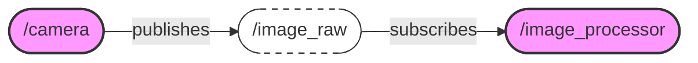

# Chapter 1: The Building Blocks of ROS 2

Welcome to the first module of our journey into Physical AI and Humanoid Robotics. In this chapter, we'll explore the fundamental building blocks of the Robot Operating System (ROS) 2. These core concepts are the foundation upon which all robotic applications are built.

## What is a ROS 2 Node?

A **Node** is the main executable in a ROS 2 system. Think of it as a small, independent program that performs a single, specific task. For example, you might have one node for controlling the wheels of a robot, another for reading data from a laser scanner, and a third for planning a path.

Each node in a ROS 2 system should be responsible for a single, well-defined purpose. This modular approach makes it easy to build complex systems that are easy to debug and maintain.

### Key Attributes of a Node

- **`name`**: Every node has a unique name that identifies it within the ROS 2 system. For example, you might name your motor control node `/motor_controller`.
- **`namespace`**: Nodes can be grouped together using namespaces. This helps to avoid name collisions when you have multiple robots or subsystems running on the same network. For example, you could have `/robot1/motor_controller` and `/robot2/motor_controller`.

In the upcoming sections, we'll see how nodes communicate with each other to create a powerful and flexible robotic system.

## How Nodes Communicate: Topics

Nodes are great, but they are not very useful on their own. They need a way to communicate with each other. This is where **Topics** come in.

A **Topic** is a named bus over which nodes exchange messages. Topics use a **publisher-subscriber** pattern. One or more nodes can **publish** messages to a topic, and one or more nodes can **subscribe** to a topic to receive those messages.

This creates a decoupled system where nodes don't need to know about each other. A publisher simply sends a message to a topic, and a subscriber receives that message without knowing where it came from.

### Key Attributes of a Topic

- **`name`**: The unique name of the topic, such as `/cmd_vel` for robot velocity commands.
- **`message_type`**: The data structure of the messages published on the topic. For example, a topic might use `std_msgs/String` for simple text messages or `geometry_msgs/Twist` for velocity commands.

### The ROS 2 Graph

The combination of nodes and topics creates what is known as the **ROS 2 Graph**. The graph is a network of all the ROS 2 nodes and their connections.

Here is a simple example of a ROS 2 graph:

In this example, we have a `/camera` node that publishes images to the `/image_raw` topic. An `/image_processor` node subscribes to this topic to receive the images and perform some processing.

## Synchronous Communication: Services

Topics are great for continuous data streams, but what if you need a synchronous, request-response style of communication? This is where **Services** come in.

A **Service** is a two-way communication pattern where a **client** node sends a request to a **server** node and waits for a response. This is a synchronous operation, meaning the client will block until it receives a response from the server.

Services are useful for tasks that have a clear beginning and end, such as triggering a specific action or querying for a piece of data.

### Key Attributes of a Service

- **`name`**: The unique name of the service.
- **`service_type`**: The data structure of the request and response messages. A service type defines both the request message and the response message.

For example, you might have a service named `/get_robot_status` that returns the current battery level and position of the robot.

## Summary and What You've Learned

In this chapter, you've learned about the three fundamental concepts of ROS 2:

- **Nodes**: The basic building blocks of a ROS 2 system, each with a single, well-defined purpose.
- **Topics**: A communication mechanism that allows nodes to publish and subscribe to streams of data.
- **Services**: A request-response communication pattern for synchronous interactions between nodes.

With these three concepts, you have the foundational knowledge to understand and build a wide variety of robotic applications with ROS 2. In the next chapter, we'll put this knowledge into practice by writing our first ROS 2 Python nodes.

