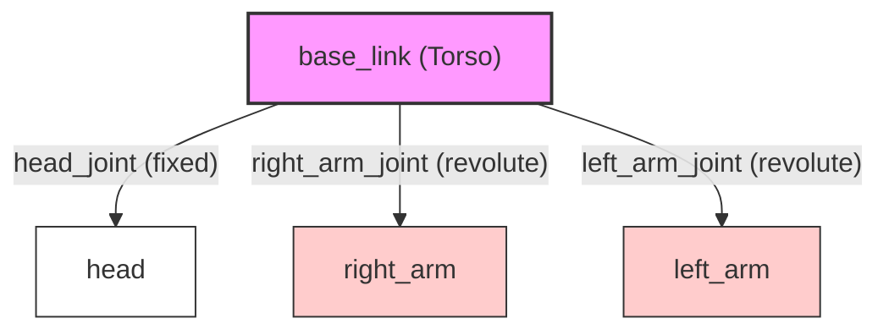

# Chapter 3: Modeling a Humanoid Robot with URDF

In the previous chapters, we've learned how to create and connect ROS 2 nodes. But what about the robot itself? How do we describe its physical structure to ROS 2?

The answer is the **Unified Robot Description Format (URDF)**. URDF is an XML format that allows us to model the physical structure of a robot, including its links, joints, and sensors.

## What is URDF?

URDF is a powerful tool for representing a robot's kinematics and dynamics. It describes the robot as a tree of links and joints.

- **Links**: These are the rigid parts of the robot, such as the torso, arms, and legs.
- **Joints**: These connect the links together and define how they can move relative to each other.

By defining the robot's structure in a URDF file, we can use ROS 2 tools to visualize the robot, perform collision checking, and even simulate its behavior.

## Key Components of a URDF File

A URDF file is an XML file with a `<robot>` element as its root. Inside the `<robot>` element, we define the links and joints of our robot.

### `<link>`

The `<link>` element describes a rigid body part of the robot. It can have three main parts:

- **`<visual>`**: Defines the visual appearance of the link, such as its shape, color, and texture.
- **`<collision>`**: Defines the collision geometry of the link, which is used for collision checking.
- **`<inertial>`**: Defines the inertial properties of the link, such as its mass and moment of inertia.

### `<joint>`

The `<joint>` element describes the kinematic and dynamic properties of a joint. It connects two links together and defines how they can move.

- **`type`**: The type of joint, which can be `revolute`, `continuous`, `prismatic`, `fixed`, `floating`, or `planar`.
- **`parent`** and **`child`**: The two links that the joint connects.
- **`origin`**: The transform from the parent link to the child link.

In the next sections, we'll create a simple URDF file for a humanoid robot, link by link.

## Our Humanoid URDF

Here is the complete URDF for our simple humanoid robot.

```xml
<?xml version="1.0"?>
<robot name="humanoid">

  <!-- Base Link -->
  <link name="base_link">
    <visual>
      <geometry>
        <box size="0.2 0.3 0.5"/>
      </geometry>
      <material name="blue">
        <color rgba="0 0 1 1"/>
      </material>
    </visual>
  </link>

  <!-- Head -->
  <link name="head">
    <visual>
      <geometry>
        <sphere radius="0.1"/>
      </geometry>
      <material name="white">
        <color rgba="1 1 1 1"/>
      </material>
    </visual>
  </link>

  <joint name="head_joint" type="fixed">
    <parent link="base_link"/>
    <child link="head"/>
    <origin xyz="0 0 0.35"/>
  </joint>

  <!-- Right Arm -->
  <link name="right_arm">
    <visual>
      <geometry>
        <box size="0.1 0.1 0.4"/>
      </geometry>
      <material name="red">
        <color rgba="1 0 0 1"/>
      </material>
    </visual>
  </link>

  <joint name="right_arm_joint" type="revolute">
    <parent link="base_link"/>
    <child link="right_arm"/>
    <origin xyz="-0.15 0 0.1"/>
    <axis xyz="0 1 0"/>
    <limit lower="-1.57" upper="1.57" effort="10" velocity="1"/>
  </joint>

  <!-- Left Arm -->
  <link name="left_arm">
    <visual>
      <geometry>
        <box size="0.1 0.1 0.4"/>
      </geometry>
      <material name="red">
        <color rgba="1 0 0 1"/>
      </material>
    </visual>
  </link>

  <joint name="left_arm_joint" type="revolute">
    <parent link="base_link"/>
    <child link="left_arm"/>
    <origin xyz="0.15 0 0.1"/>
    <axis xyz="0 1 0"/>
    <limit lower="-1.57" upper="1.57" effort="10" velocity="1"/>
  </joint>

</robot>
```

### URDF Structure Explained

Our humanoid robot has a `base_link` which is the torso. It has a `head` connected by a `fixed` joint, and two arms connected by `revolute` joints, which allow them to rotate.

Here is a diagram of the link-joint tree structure:



## Validating and Visualizing the URDF

Now that we have our URDF file, we need to check it for errors and visualize it to make sure it looks correct.

### Validating with `check_urdf`

ROS 2 provides a handy tool to check the syntax of your URDF file. Open a terminal, navigate to the directory containing your `humanoid.urdf` file, and run the following command:

```bash
check_urdf humanoid.urdf
```

If your URDF is valid, you will see a message like "Successfully Parsed XML". If there are any errors, the tool will report them.

### Visualizing with RViz2

To visualize our robot, we need a few more pieces. We need to publish the robot's state to ROS 2 topics so that RViz2, the ROS 2 visualizer, can display it.

1.  **`robot_state_publisher`**: This tool reads the URDF file and publishes the static transforms of the robot's links.
2.  **`joint_state_publisher_gui`**: This tool provides a GUI to move the robot's joints.

You can run these tools and RViz2 with the following commands.

**Terminal 1:**

```bash
# Publish the robot description
ros2 run robot_state_publisher robot_state_publisher humanoid.urdf
```

**Terminal 2:**

```bash
# Publish the joint states
ros2 run joint_state_publisher_gui joint_state_publisher_gui
```

**Terminal 3:**

```bash
# Run RViz2
rviz2
```

In RViz2, you will need to:
1.  Set the "Fixed Frame" to `base_link`.
2.  Add a "RobotModel" display and it should show your humanoid robot.
3.  Use the `joint_state_publisher_gui` to move the arms of the robot.

This process of modeling, validating, and visualizing is a fundamental workflow in robotics.

