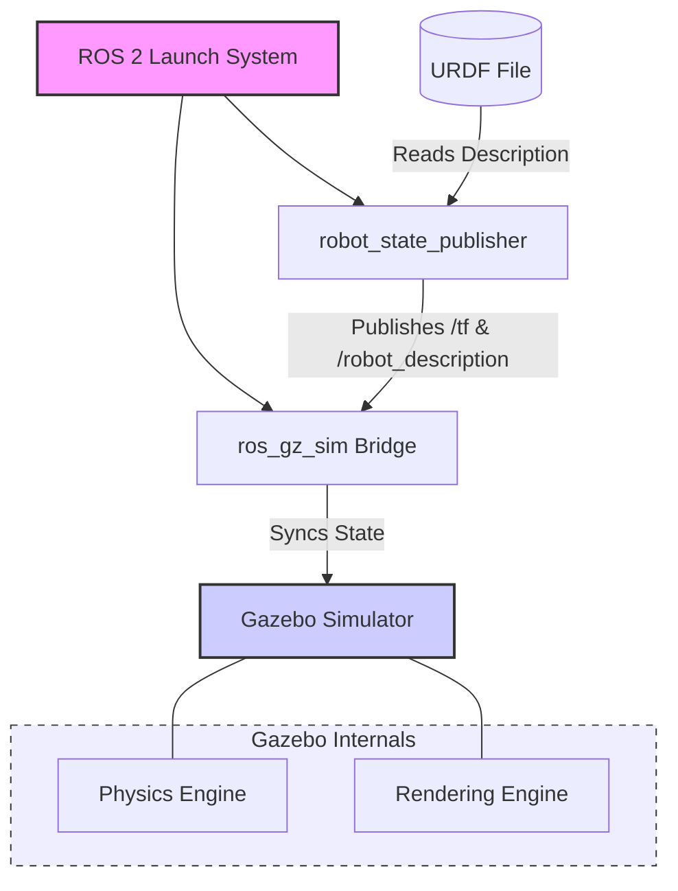

# Chapter 1: Physics-Based Simulation in Gazebo

Welcome to Module 2, where we dive into the world of digital twins and robotics simulation. In this chapter, we'll explore Gazebo, a powerful 3D robotics simulator, focusing on its physics-based simulation capabilities.

## What is Gazebo?

Gazebo is an open-source 3D robotics simulator that allows you to accurately and efficiently simulate populations of robots in complex indoor and outdoor environments. It offers:

-   **Robust physics engine**: Gazebo uses physics engines like ODE, Bullet, Simbody, and DART to simulate realistic interactions between objects, including gravity, collisions, and friction.
-   **High-quality graphics**: It provides realistic rendering of environments and robots.
-   **Sensor simulation**: Gazebo can simulate a wide range of sensors, including cameras, depth cameras, LiDAR, and IMUs.
-   **ROS 2 integration**: Seamless integration with ROS 2 allows you to use your ROS 2 nodes to control simulated robots and process sensor data.

## Physics-Based Simulation

The core of Gazebo's power lies in its ability to simulate physics. When you place a robot or an object in a Gazebo world, it will react realistically to physical forces.

### Gravity

Every object in a Gazebo world is affected by gravity. If you place a robot in the air, it will fall until it hits a surface. This is crucial for realistic robot behavior.

### Collisions and Dynamics

Gazebo simulates collisions between objects. When two objects collide, the physics engine calculates the forces and resulting motion. This is essential for preventing robots from passing through walls or other objects.

## Gazebo Worlds and Models

In Gazebo, a simulation is defined by a "world" file (typically in `.sdf` format) and "model" files (often URDF for robots).

-   **Gazebo World**: Defines the environment, including the ground plane, lights, and any static objects. It also sets global physics parameters like gravity.
-   **Robot Models**: These describe the physical properties of your robot, including its links, joints, and visual appearance. As we learned in Module 1, URDF is a common format for robot descriptions.

## Loading a URDF Model into Gazebo

To simulate a robot in Gazebo, you typically:
1.  Define your robot's structure using a URDF file (like the humanoid robot we created in Module 1).
2.  Create a Gazebo world file that includes your robot model.

Here's a conceptual overview:

```xml
<!-- Example of a simple Gazebo world file (.sdf) that includes a robot -->
<sdf version="1.7">
  <world name="default">
    <gravity>0 0 -9.8</gravity>
    <include>
      <uri>model://ground_plane</uri>
    </include>
    <include>
      <uri>model://sun</uri>
    </include>
    <include>
      <uri>file://path/to/your/humanoid.urdf</uri> <!-- How to include your robot -->
    </include>
    <!-- You can also define your robot directly here or link to a .urdf file via a model:// URI -->
    <model name='humanoid_robot'>
      <pose>0 0 1.0 0 0 0</pose> <!-- Initial pose of the robot -->
      <link name='base_link'>
        <inertial>
          <mass>1.0</mass>
          <inertia>
            <ixx>0.01</ixx>
            <ixy>0.0</ixy>
            <ixz>0.0</ixz>
            <iyy>0.01</iyy>
            <iyz>0.0</iyz>
            <izz>0.01</izz>
          </inertia>
        </inertial>
        <visual name='visual'>
          <geometry>
            <box>1 0.5 0.2</box>
          </geometry>
        </visual>
        <collision name='collision'>
          <geometry>
            <box>1 0.5 0.2</box>
          </geometry>
        </collision>
      </link>
    </model>
  </world>
</sdf>
```

In the next sections, we will create a simple Gazebo world and load our humanoid robot into it.

## Loading a URDF Model into Gazebo

To load our humanoid robot (from Module 1) into Gazebo, we'll leverage the `ros_gz_sim` package. This package provides tools to bridge ROS 2 and Gazebo.

### 1. Create a Gazebo World File

We've already created a basic `humanoid_world.sdf` file in `book/src/examples/gazebo/`. This file defines the environment for our simulation.

### 2. Launch the Robot in Gazebo

Typically, you would use a ROS 2 launch file to bring up your robot in Gazebo. This allows you to combine the Gazebo simulation with ROS 2 nodes (like `robot_state_publisher` for URDF parsing).

Create a new launch file, `launch_humanoid_in_gazebo.launch.py`, in `book/src/examples/gazebo/` with the following content:

```python
import os
from ament_index_python.packages import get_package_share_directory
from launch import LaunchDescription
from launch_ros.actions import Node
from launch.actions import IncludeLaunchDescription
from launch.launch_description_sources import PythonLaunchDescriptionSource

def generate_launch_description():
    pkg_ros_gz_sim = get_package_share_directory('ros_gz_sim')
    
    # Path to the URDF file
    # This assumes the humanoid.urdf from Module 1 is in a ROS 2 package
    # For this example, we'll assume it's directly accessible or copied to a models directory
    # For a real project, it would be in a package's 'share' directory.
    urdf_path = os.path.join(
        os.getenv('GEMINI_WORKSPACE', '/tmp'), # Replace with your actual workspace path if needed
        'book', 'src', 'examples', 'ros2', 'humanoid.urdf' # Path to our humanoid URDF
    )

    # Gazebo launch
    gazebo = IncludeLaunchDescription(
        PythonLaunchDescriptionSource(
            os.path.join(pkg_ros_gz_sim, 'launch', 'gz_sim.launch.py')
        ),
        launch_arguments={'gz_args': '-r -s /tmp/humanoid_world.sdf'}.items() # Point to your world file
    )

    # Robot State Publisher
    # This node reads the URDF and publishes the robot's state to ROS 2 topics
    robot_state_publisher = Node(
        package='robot_state_publisher',
        executable='robot_state_publisher',
        name='robot_state_publisher',
        output='screen',
        parameters=[
            {'robot_description': open(urdf_path, 'r').read()}
        ]
    )

    return LaunchDescription([
        gazebo,
        robot_state_publisher
    ])
```

**Explanation**:
-   We include `gz_sim.launch.py` from `ros_gz_sim` to start Gazebo.
-   We pass arguments to `gz_sim.launch.py` to load our `humanoid_world.sdf`.
-   The `robot_state_publisher` node is crucial. It parses our `humanoid.urdf` file and broadcasts the robot's joint states and transformations to the ROS 2 topic `/tf`. Gazebo can then use this information to display the robot correctly.

### Running the Gazebo Simulation

1.  Make sure you have sourced your ROS 2 environment.
2.  Navigate to `book/src/examples/gazebo/` and copy `humanoid_world.sdf` and `launch_humanoid_in_gazebo.launch.py` there.
3.  Execute the launch file:
    ```bash
    ros2 launch launch_humanoid_in_gazebo.launch.py
    ```

This command will open Gazebo, load your world, and display your robot, which will then fall due to gravity.

## Gazebo Simulation Architecture

Here's an overview of how the different components interact in a Gazebo simulation integrated with ROS 2:




