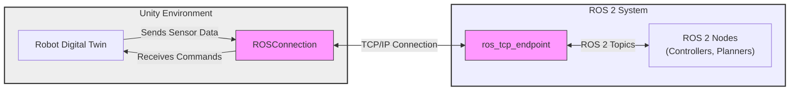

# Chapter 2: Building High-Fidelity Digital Twins in Unity

While Gazebo excels at physics-based simulation, Unity offers unparalleled capabilities for creating visually rich and interactive digital twins. In this chapter, we'll explore how to leverage Unity to build high-fidelity representations of our robots, complete with realistic graphics and advanced interaction possibilities.

## Why Unity for Digital Twins?

Unity is a powerful real-time 3D development platform widely used for games, visualizations, and simulations. Its strengths make it ideal for digital twins:

-   **High-Quality Rendering**: Advanced lighting, materials, and post-processing effects for visually stunning simulations.
-   **Interactive Environments**: Easy creation of complex scenes with dynamic objects and user interaction.
-   **Extensible Architecture**: A robust component-based system and extensive asset store.
-   **ROS 2 Integration**: Official support through the Unity Robotics packages.

## Importing a Robot Model into Unity

To create a digital twin, you first need a 3D model of your robot. While URDF is common in ROS, Unity typically uses formats like FBX, OBJ, or GLB. You can convert URDF to these formats or use a model directly created in a 3D modeling software.

### Steps to Import a Model:

1.  **Prepare your 3D Model**: Ensure your robot model has a clean hierarchy and appropriate materials. If starting from URDF, tools like `urdf_to_scene` or `urdf_to_collada` can help convert it to a format Unity can import.
2.  **Open Unity Project**: Open your Unity project (or create a new 3D project).
3.  **Import Asset**: Drag and drop your 3D model file (e.g., `.fbx`) into the `Assets` folder in your Unity project, or go to `Assets > Import New Asset...`.
4.  **Place in Scene**: Drag the imported model from the `Assets` folder into the `Hierarchy` window to place it in your scene.

Once imported, you can manipulate the robot's position, rotation, and scale directly within the Unity editor.

## Setting up a Realistic Unity Scene

A digital twin isn't just about the robot; it's also about its environment. Unity provides powerful tools to create visually compelling scenes:

-   **Lighting**: Add and configure various light sources (directional, point, spot) to mimic real-world lighting conditions. Use Global Illumination for realistic bounced light.
-   **Materials and Textures**: Apply PBR (Physically Based Rendering) materials to your robot and environment objects for realistic surface properties (e.g., metallic, rough, diffuse).
-   **Post-Processing**: Enhance visuals with effects like Bloom, Ambient Occlusion, Depth of Field, and Anti-aliasing using the Post-Processing Stack (Window > Package Manager > Post Processing).
-   **Environment**: Create floors, walls, and other static objects using Unity's built-in 3D objects or imported assets.

By carefully configuring these elements, you can create a digital twin environment that closely resembles the real world.

## Communicating with ROS 2: ROS-TCP-Connector

Unity's official **ROS-TCP-Connector** package facilitates communication between your Unity digital twin and a ROS 2 system. This allows you to send commands from your ROS 2 controllers to the robot in Unity and receive sensor data back.

### How it works:

-   The ROS-TCP-Connector establishes a TCP connection between Unity and a ROS 2 bridge node (`ros_tcp_endpoint`).
-   It provides C# APIs within Unity to create Publishers, Subscribers, Service Clients, and Servers that mirror their ROS 2 counterparts.
-   Messages are serialized and deserialized across the TCP connection.

### Key Components:

-   **`ROSConnection`**: A singleton in your Unity scene that manages the TCP connection to the ROS 2 endpoint.
-   **`Publisher` / `Subscriber`**: Unity C# scripts that inherit from `Unity.Robotics.ROSTCPConnector.MessageGeneration.Publisher` or `Subscriber` to send/receive messages.
-   **ROS 2 Bridge Node (`ros_tcp_endpoint`)**: A ROS 2 node running on your ROS 2 system that acts as the communication endpoint for Unity.

In the next sections, we'll demonstrate how to import a robot model, set up a scene, and use the ROS-TCP-Connector to enable communication.

## Unity and ROS 2 Integration Architecture

Here's an overview of how Unity integrates with ROS 2:

