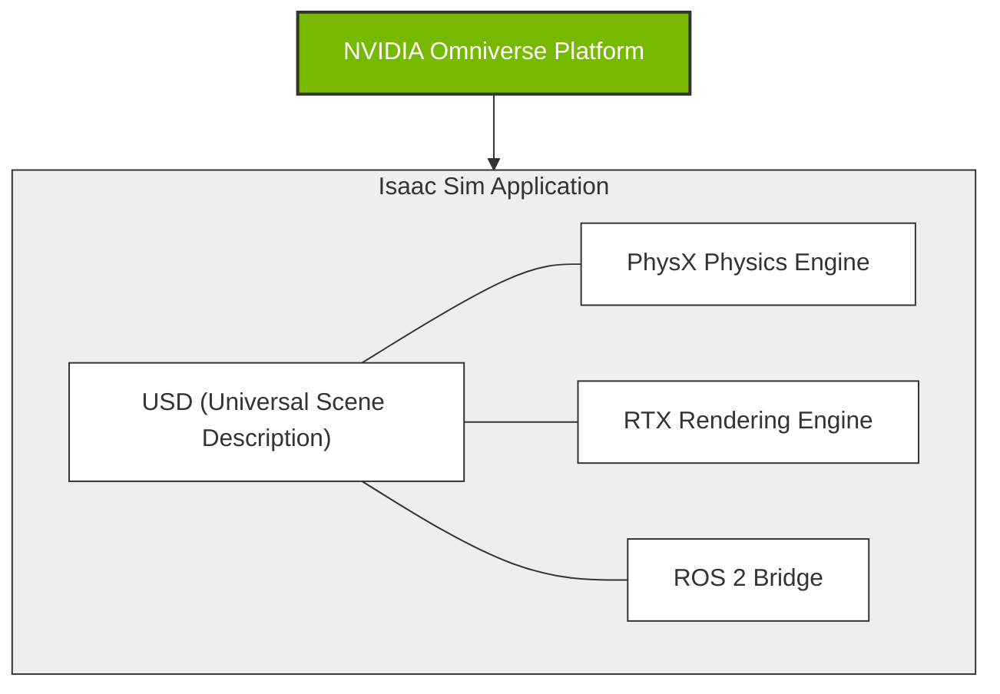

# Chapter 1: Introduction to Isaac Sim for Robotics

Welcome to the first chapter of our module on the AI-Robot Brain! NVIDIA Isaac Sim is a powerful robotics simulation platform built on NVIDIA Omniverse. It enables the design, simulation, testing, and training of AI-based robots in a photorealistic, physics-accurate virtual environment.

In this chapter, you will learn the fundamentals of Isaac Sim, including:
- Setting up a simulation scene.
- Importing a robot model.
- Understanding the basics of synthetic data generation.

## Setting up a Simulation Scene

A scene in Isaac Sim is the container for your environment, robots, and other objects. Let's start by creating a simple scene with a ground plane.



1.  **Launch Isaac Sim**.
2.  From the top menu, go to `Create -> Physics -> Ground Plane`. This adds a flat surface for our robot to stand on.
3.  You can also add other basic shapes like cubes and spheres from the `Create -> Shape` menu to act as obstacles or points of interest.

## Importing a Robot Model

Isaac Sim supports importing robot models from various formats, with URDF (Unified Robot Description Format) being the most common.

Let's import a sample robot:

1.  From the top menu, go to `Create -> Isaac -> Robots -> UR10`. This will load a Universal Robots UR10 model into the scene.
2.  The robot will appear in the `Stage` panel on the right, where you can inspect its components (links, joints, etc.).

## Simulation Basics

With a scene and a robot, you can start the simulation.

-   Click the "Play" button at the top of the viewport to start the physics simulation. The robot should now be affected by gravity and settle on the ground plane.
-   You can apply forces to objects, control robot joints, and read sensor data through Python scripting.

Here is a basic example of a Python script to interact with the simulation:

```python file=../../src/examples/isaac_sim/hello_robot.py

```

## Synthetic Data Generation

A key feature of Isaac Sim is its ability to generate synthetic data for training AI models. You can add virtual sensors to your robot and generate data like:
-   RGB camera images
--   Depth images
-   Semantic segmentation masks
-   Lidar point clouds

We will explore this in more detail in the next chapter.

This chapter provided a brief introduction to the core concepts of Isaac Sim. In the following chapters, we will build upon this foundation to create more complex simulations and integrate them with ROS 2.