# Chapter 2: Perception with Isaac ROS

This chapter dives into the world of hardware-accelerated perception using NVIDIA's Isaac ROS packages. These packages are optimized to run on NVIDIA's Jetson platform and other devices with NVIDIA GPUs, providing significant performance improvements for computationally intensive robotics tasks.

## What is Hardware Acceleration?

In robotics, perception algorithms like Simultaneous Localization and Mapping (SLAM), object detection, and stereo depth estimation require a massive number of calculations. Performing these on a standard CPU can be slow and consume a lot of power.

Hardware acceleration offloads these computations to specialized hardware, like a GPU, which can perform many calculations in parallel. This results in:
-   **Higher throughput**: Process more data per second (e.g., higher camera frame rates).
-   **Lower latency**: Get results faster, which is critical for real-time robot control.
-   **Improved power efficiency**: GPUs are more efficient at parallel computations than CPUs.

## VSLAM Pipeline with Isaac ROS

Visual SLAM (VSLAM) is the process of using camera data to build a map of an environment while simultaneously tracking the robot's position within that map. Isaac ROS provides a hardware-accelerated VSLAM package.

```mermaid
graph LR;
    camera[Camera Node]
    rectify[Rectify Node]
    tracker[Feature Tracker Node]
    vslam[VSLAM Node]
    map_pub[Map Publisher Node]

    camera -- Raw Images --> rectify
    rectify -- Rectified Images --> tracker
    tracker -- Tracked Features --> vslam
    vslam -- Pose & Map Data --> map_pub

    style camera fill:#f9f,stroke:#333
    style rectify fill:#ccf,stroke:#333
    style tracker fill:#ccf,stroke:#333
    style vslam fill:#76b900,stroke:#333,color:#fff
    style map_pub fill:#ccf,stroke:#333
```



A typical Isaac ROS VSLAM pipeline consists of several nodes working together:

1.  **Camera Node**: Publishes raw camera images and camera info.
2.  **Rectify Node**: Corrects for lens distortion in the images.
3.  **Feature Tracker Node**: Identifies and tracks keypoints across consecutive images.
4.  **VSLAM Node**: Takes the tracked features and performs the core SLAM algorithm to estimate the robot's pose and build the map.
5.  **Map Publisher Node**: Publishes the generated map for visualization or navigation.

In the next sections, we will set up and run this pipeline.

### Running the VSLAM Pipeline

Here is an example of a launch file to start the VSLAM node:

```python file=../../src/examples/isaac_ros/vslam.launch.py

```

To run this launch file, you would use the `ros2 launch` command:

```bash
ros2 launch your_package_name vslam.launch.py
```

Make sure to replace `your_package_name` with the actual name of your ROS 2 package.