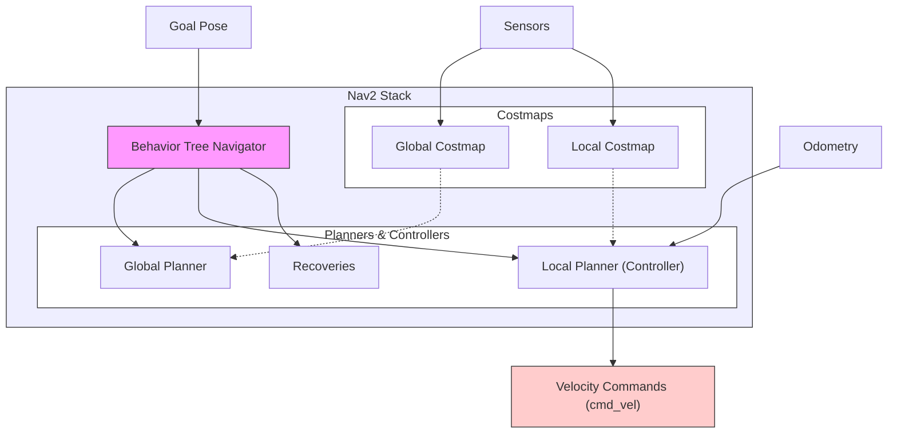

# Chapter 3: Navigation with Nav2

The Navigation2 project, or Nav2, is the official navigation stack in ROS 2. It's a powerful and flexible system for enabling a robot to move from one point to another safely. This chapter provides a high-level overview of Nav2, with a focus on concepts relevant to humanoid robotics.

## Core Components of Nav2

Nav2 is not a single program, but a collection of nodes and servers that work together. The main components are:



-   **Global Planner**: Given a goal, this component creates a long-range plan from the robot's current position to the goal. It operates on a global costmap.
-   **Local Planner (Controller)**: This component generates velocity commands to send to the robot's base. It tries to follow the global plan while avoiding local obstacles. It operates on a local costmap.
-   **Costmaps**: These are 2D or 3D grids that represent the "cost" of traversing a particular area. Obstacles have a high cost. There are typically two costmaps: a global one for long-range planning and a local one for short-range obstacle avoidance.
-   **Behaviors**: Nav2 uses a behavior tree to orchestrate the entire navigation process. This allows for complex logic like recovery behaviors (e.g., if the robot gets stuck).

## Navigation with Humanoid Robots

While Nav2 is often used with wheeled robots, its components can be adapted for humanoid robots. The main challenge is the difference in locomotion.

-   **Local Planner**: The standard local planners in Nav2 are designed for differential drive or holonomic robots. For a humanoid, you would need a custom local planner that can generate walking commands (e.g., footstep plans) instead of simple velocity commands.
-   **Costmaps**: The costmap representation is still very useful for humanoids to understand where they can and cannot walk.

## The Navigation Process

1.  A goal (an (x, y, theta) pose) is sent to the Nav2 stack.
2.  The behavior tree starts the navigation process.
3.  The global planner creates a path.
4.  The local planner generates walking commands to follow the path.
5.  If the robot encounters an obstacle, the local planner tries to avoid it.
6.  If the robot gets stuck, recovery behaviors are triggered.
7.  The process ends when the robot reaches the goal.

## Running the Integrated Example

This module culminates in an integrated example that brings together simulation, perception, and navigation.

### Launching the Stack

The following launch file starts the VSLAM and Nav2 stacks. It assumes that you have Isaac Sim running separately.

```python file=../../src/examples/isaac_ros/integrated_nav.launch.py

```

To run this launch file:

```bash
ros2 launch your_package_name integrated_nav.launch.py
```

### Sending a Goal

Once the stack is running, you can send a navigation goal using the "Nav2 Goal" tool in RViz2, or by publishing to the `/goal_pose` topic. The robot should then begin navigating to the goal in the Isaac Sim environment.