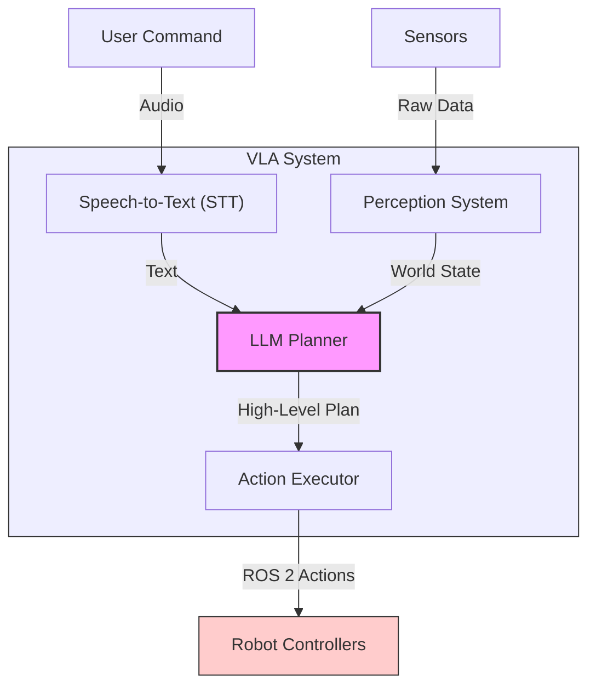

# Chapter 1: Vision-Language-Action (VLA) Architecture

Welcome to the final module of our book! Here, we will bring everything together to create a robot that can understand natural language, perceive its environment, and execute complex tasks. This is the realm of Vision-Language-Action (VLA) models.

## What is a VLA Pipeline?

A VLA pipeline is a system that integrates three key AI capabilities:
1.  **Vision**: Understanding the world through camera feeds and other sensors.
2.  **Language**: Processing and understanding natural language commands from a user.
3.  **Action**: Generating a sequence of actions for a robot to execute in the physical world.

The goal is to create an "end-to-end" system where a user can simply tell a robot what to do, and the robot figures out how to do it.

## High-Level Architecture

A VLA pipeline is typically composed of several components working in concert:

1.  **Speech-to-Text (STT)**: This component takes the user's spoken command and converts it into text.
2.  **LLM Planner**: This is the "brain" of the operation. A Large Language Model (LLM) takes the text command, along with information about the current state of the world from the perception system, and generates a high-level plan.
3.  **Perception System**: This system uses cameras and other sensors to build a representation of the world. This could include object detection, localization (where the robot is), and mapping.
4.  **Action Executor**: This component takes the high-level plan from the LLM and translates it into a sequence of concrete ROS 2 actions or service calls that the robot's controllers can understand.
5.  **Robot Controllers**: These are the low-level controllers (like those discussed in Module 1) that move the robot's joints and actuators.

In the following chapters, we will build each of these components and integrate them to create our own VLA-powered autonomous humanoid.